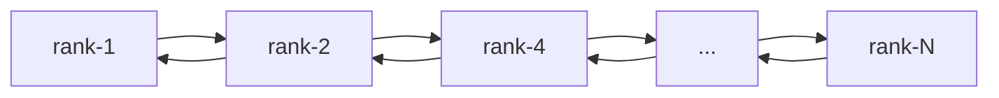
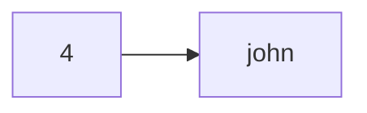

The main idea is to distribute the keys by ranks, the rank of the key increases when accessing the value. Ranks stored in **doubly linked list**, where head - **node with lowest rank table**:

For O(1) random access **delete/insert** operations each node additionally stored in **map**:
```
| rank | pointer         |
|------|-----------------|
| 1    | address(rank-1) |
| 2    | address(rank-1) |
| 4    | address(rank-4) |
| ...  | ...             |
| N    | address(rank-N) |
```

Each **rank table** is **ordered key/value map**, for example, keys *4* and *john* have same rank and store in one **rank table**:
```
| key  | value |
|------|-------|
| 4    | 16    |
| john | doe   |
```
Order of addition stored in **doubly linked list queue**:

In that way new *key* append to **rank-1**, then with each use *key* migrate to **rank-(current + 1)**. During migration key deleted from previos **rank**, if after delete previous **rank** become empty, they removed from list with ranks.